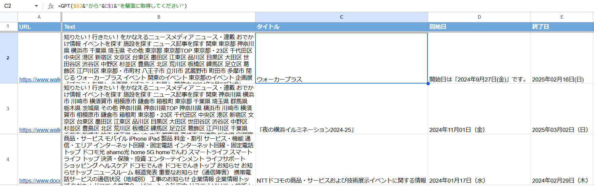

## 概要

- SpreadsheetでLLMを使えるようにした
- Crawlerと組み合わせることでwebページの要約、情報抽出ができる
- Prompt Engineering頑張るとかなり使えた

## なぜ作ろうと思ったのか

元々は[ChatGPT in Google Sheets™ and Docs](https://workspace.google.com/marketplace/app/chatgpt_for_google_slides_docs_sheets/451400884190)というChrome拡張を使っていて、Open AIのAPI Keyさえあれば便利に使えた。

のだが、最近独自の課金体系を設けるようになってしまったので、それはちょっと、、と思って自作することにした。

ただし、独自の課金体系があるくらいには機能が充実しているっぽく、いろいろなユースケース向けのプリセットやGoogle Docs, Google Slidesにも対応している。
あとはユーザーがAPI Keyを不要にすることで、利用する敷居を下げている。

## 自作GPT関数の作り方

作り方といってもSpreadsheetのスクリプトエディタにコードを書くだけである。

API KeyはOpenAIのサイトで取得し、GASのスクリプトプロパティに設定する。

```javascript
function GPT(prompt, temperature=1.0, maxToken=1024) {
  //スクリプトプロパティに設定したOpenAIのAPIキーを取得
  const apiKey = PropertiesService.getScriptProperties().getProperty('API_KEY');
  //OpenAIのAPIで利用するモデルとしてgpt-4oを設定
  const model = 'gpt-4o';
  //GPTのAPIのエンドポイントを設定
  const apiUrl = 'https://api.openai.com/v1/chat/completions';
  //GPTに投げるメッセージを定義(ユーザーロールの投稿文のみ)
  const messages = [
    {'role': 'user', 'content': prompt}
  ];
  //OpenAIのAPIリクエストに必要なヘッダー情報を設定
  const headers = {
    'Authorization':'Bearer '+ apiKey,
    'Content-type': 'application/json',
    'X-Slack-No-Retry': 1
  };
  //GPTのモデルやトークン上限、プロンプトをオプションに設定
  const options = {
    'muteHttpExceptions' : true,
    'headers': headers, 
    'method': 'POST',
    'payload': JSON.stringify({
      'model': model,
      'max_tokens' : maxToken,
      'temperature' : temperature,
      'messages': messages})
  };
  //OpenAIのGPTにAPIリクエストを送り、結果を変数に格納
  const response = JSON.parse(UrlFetchApp.fetch(apiUrl, options).getContentText());
  return response.choices[0].message.content; 
}

function test() {
  console.log(GPT("test"));
}
```

以下の部分で様々なPrompt Engineeringを行うことができる。

例えば、テーブル分析に向いてる関数、要約に向いてる関数、質問応答に向いてる関数など作ることができると思う。

```javascript
  const messages = [
    {'role': 'user', 'content': prompt}
  ];
```

## Spreadsheetでの使い方

使い方は簡単で、セルに`=GPT("hogehoge")`と入力するだけである。

その他のセル情報を活用したい場合は、

```spreadsheet
=GPT($B2&"から"&C$1&"を簡潔に取得してください")
```

のようにすることで、セルの情報を活用することができる。

また、以下のコードと組み合わせることで、webページのテキスト情報を抽出し、要約や情報抽出ができる。

```spreadsheet
=ARRAYFORMULA(TRIM(REGEXREPLACE(TEXTJOIN(" ", TRUE, IMPORTXML(A2, "//body//text()[not(ancestor::script)][not(ancestor::style)][normalize-space()]")), "\s+", " ")))
```

使い方のイメージは以下の通り。



## 使い方 Tips

- Webページごとに情報構造が異なるので、Crawlerの設定を変えることで、情報抽出の精度を上げることができる。
- 抽出したい情報に併せてGPT関数内のプロンプトをカスタマイズすることで、より適切な情報抽出ができる。
  - e.g. `=GPT($B2&"から"&D$1&"をYYYY年mm月dd日（月）形式で該当部分の年月日、曜日のみを出力してください")`
