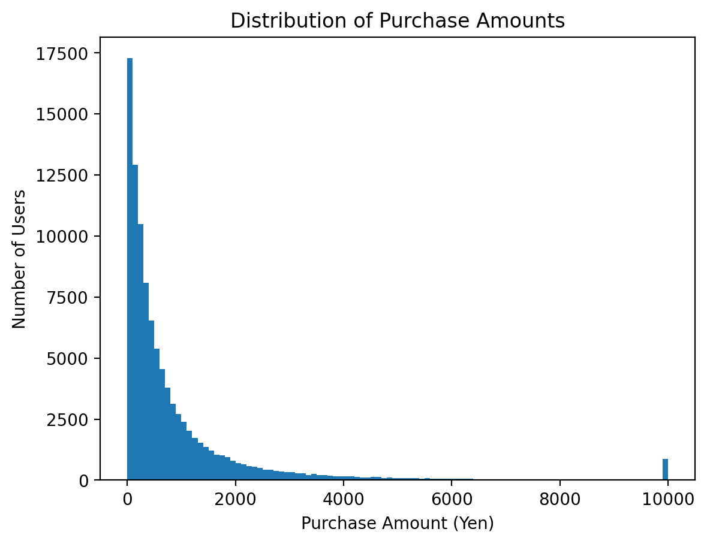
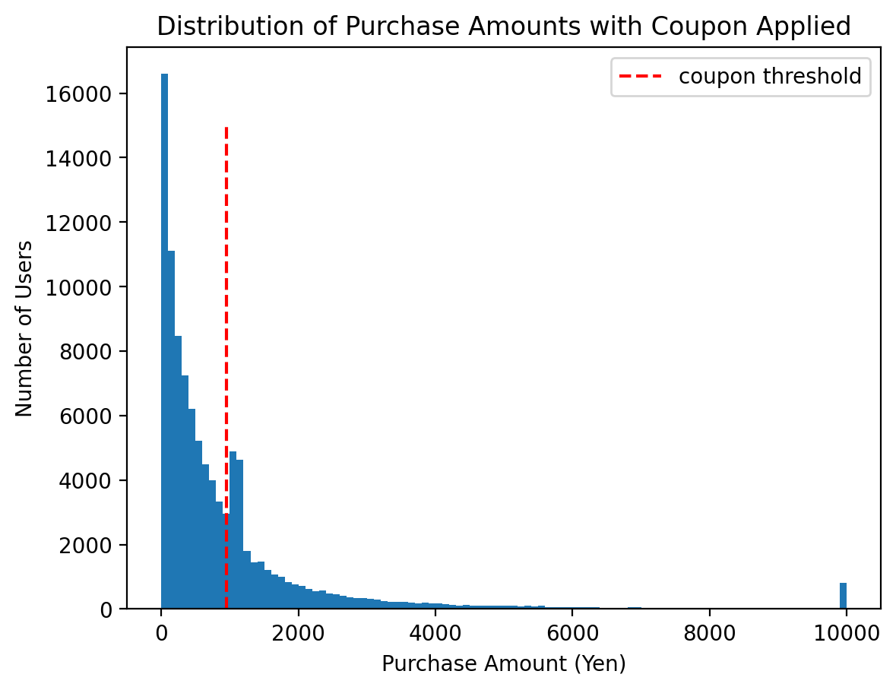

## はじめに

この記事ではクーポン配布施策について書いていく。

こういった施策をやるよ、となったときに自分なりのテンプレートがあるのであとで思い出せるように残しておこうと思った。

同じようにクーポン配布施策をやることになったときに参考にしてもらえると嬉しい。

## クーポン配布の背景と目的

クーポン配布の目的はさまざま考えられるが、この記事内では以下のような目的とする。

1. 売り上げを伸ばしたい
1. 予算を使い切りたい

１つ目は、新規ユーザーを獲得したり、１人あたりの単価を上げることなどが考えられる。
２つ目は、単純にディスカウント分をユーザーが利用することで、予算を使い切ることができる。

## 既存データからディスカウント条件を決定

話をシンプルにするためにひとまず「X円以上の購入でY円割引」という条件でディスカウントを適用することにする。

まずはX, Yを決定するために１人あたりの購買単価の分布を見てみる。

大体こういうのは下図のようなロングテールのグラフになるだろ、という仮定でデモデータを生成した。

X軸は１人あたりの購買金額、Y軸はその金額を購入したユーザー数を表している。



このグラフはご存知の通り、右側が重課金ユーザー、左側がライトユーザーの分布を表している。

右側のユーザーは何もしなくても購買行動をするので、ディスカウント件を配布してもそれは企業がタダで金を使っているだけとなる。

逆にライトすぎるとそもそも欲しいものがない、などがありディスカウント件を配布しても効果が薄い。

つまり、どこにディスカウント条件設けるといいかというと、大体この辺りだろうと。


大体でいんです、最初は。

**今回はX=1,000円, Y=20%という条件でディスカウントを適用することにする。**
わかりやすくいうと「1,000円以上の購入で200円割引」ということ。

## ユーザーに価値が伝わるUXを考える

せっかくお金を配って、ユーザーにとってメリットもあるはずなのに、それが伝わらないと意味がない。
またユーザーがそれを受け入れやすいような意味づけをすることも重要。

とはいえ難しい話ではなくて、以下のようなことを指している。

見せ方で言うと、1,000円以上の購入で200円割引、2 Buy 1 Get 1 Free、10,000円以上で送料無料、などがある。

動機付けで言うと、誕生日、初回購入、時間制限付き

とにかくユーザーがメリットを感じるかを確認することが重要。

## レポーティングの雛形

Outlineは、

- ディスカウント条件の決定理由
- ディスカウント条件の詳細
  - X円以上の購入でY円割引
  - 有効期限
  - 適用条件
- 配布実績
  - 配布ユーザー数
  - クーポン利用率
  - 平均購買単価の変化
  - 購買UU数の変化
- ディスカウント条件の変更案

大体こう言うことを書いておけばよくて、クーポン配布後の購買単価の分布は大体以下のようになる。

[「データ分析の力 因果関係に迫る思考法」](https://www.amazon.co.jp/dp/4334039863/ref=cm_cr_lh_d_bdcrb_top)では、集積分析という名前で紹介されている。



ちなみに、今回のサンプルデータでは以下のように変化した。

- 通常時
  - 平均購買単価: 916 円
  - 累計購買金額: 91,618,703 円
- クーポン適用後
  - 平均購買単価: 963 円
  - 累計購買金額: 96,305,593 円

平均購買単価が、約5%上昇したことになる。

あとは先ほど決めた、X,Yやユーザーへの伝え方を変えるABテストを繰り返すことで、より効果的なディスカウント条件を見つけることができる。

## マニュアルが機能する前提条件

ここまでみてもらったことが再現するにはいくつか条件がある。

- 購買単価の分布がロングテールになっていること
- ディスカウント条件がユーザーに伝わっていること
- **ユーザーが自身の購買単価を操作可能であること** ← これが一番重要

## まとめ

- 平均購買単価のヒストグラムを見て、ディスカウント条件を決定するといいよ
- ディスカウント条件はユーザーに伝わるように工夫するといいよ
- レポートの雛形は作っておくといいよ
- X, Yを操作する、ユーザーへの伝え方を変えるABテストをするといいよ
- ユーザーが自身の購買単価を操作可能であることが重要だよ

## 余談：時限式クーポンについて

「ユーザーへの伝え方」の文脈で、時限式クーポンについて触れておく。

この記事で最初においた目的として「売上を伸ばしたい」というのがあった。

実は時限式クーポンは、ユーザーの意思決定を早める効果は期待されるのだがトータルの売上を伸ばす効果はあまり期待できない。なぜかというと明日買おうと思っていたものを今日買うようになったとしても、トータルの売上は変わらないからだ。

ただしクーポン使用率が高かったり、瞬間的な売上を伸ばす効果はあるためレポーティングではその実態を把握できることは少ない。わかりやすく今日の売り上げは伸びるから。

長期的にみて意味のあることかも意識しないといけないよね、と思ってる。

その他これについて個人的に思うことは以下の通り。

- 時間制限は短ければ短いほど効果がある
  - 効能としてはユーザーの意思決定を早める効果がある
  - 予算消化したいとき、KPI達成したいとか便利
  - 見せ方は派手などよい
- 1ヶ月とか1年とかの有効期限はなんなの？
  - 配る側は忘れることを期待してる
  - 事業会社が合法的に発行できる通貨であり、失効条件も握っているためクーポン使用率を操作したいときに便利
  - そのため見せ方も目立たない方がいい

## Source Code

User Class

```python
class User:
    def __init__(self, user_id):
        self.user_id = user_id
        self.max_purchase_amount = 10000

    def generate_purchase_amount(self):
        purchase_amount = np.random.pareto(a=2.0) * self.max_purchase_amount / 10
        purchase_amount = min(max(purchase_amount, 0), self.max_purchase_amount)
        return purchase_amount

    def apply_coupon(
        self,
        purchase_amount,
        coupon_threshold: float = 1000.0,
        discount_rate=0.2,
    ):
        if purchase_amount < coupon_threshold:
            probability = 1 - (coupon_threshold - purchase_amount) / coupon_threshold
            if np.random.rand() < probability:
                purchase_amount += coupon_threshold * discount_rate
        return purchase_amount
```

通常時の購入金額の分布

```python
num_users = 100000
users = [User(user_id=i) for i in range(num_users)]
purchase_amounts = [user.generate_purchase_amount() for user in users]

plt.hist(purchase_amounts, bins=100)
plt.xlabel('Purchase Amount (Yen)')
plt.ylabel('Number of Users')
plt.title('Distribution of Purchase Amounts')
plt.show()
```

クーポン適用後の購入金額の分布

```python
users = [User(user_id=i) for i in range(num_users)]
coupon_threshold = 1000

purchase_amounts = []
for user in users:
    amount = user.generate_purchase_amount()
    amount = user.apply_coupon(amount, coupon_threshold, discount_rate=0.2)
    purchase_amounts.append(amount)

plt.hist(purchase_amounts, bins=100)
plt.vlines(coupon_threshold * 0.95, 0, len(users) * 0.15, colors='r', linestyles='dashed', label="coupon threshold")
plt.xlabel('Purchase Amount (Yen)')
plt.ylabel('Number of Users')
plt.title('Distribution of Purchase Amounts with Coupon Applied')
plt.legend()
plt.show()
```

平均購買単価

```python
from typing import List
import numpy as np

def purchase_statistics(purchase_amounts: List[float]):
  average_amount = np.mean(purchase_amounts)
  total_amount = np.sum(purchase_amounts)
  users_between_1000_1500 = len([amount for amount in purchase_amounts if 1000 <= amount <= 1500])

  print(f"平均購買単価: {average_amount:.2f}")
  print(f"累計購買金額: {total_amount:.2f}")
```
