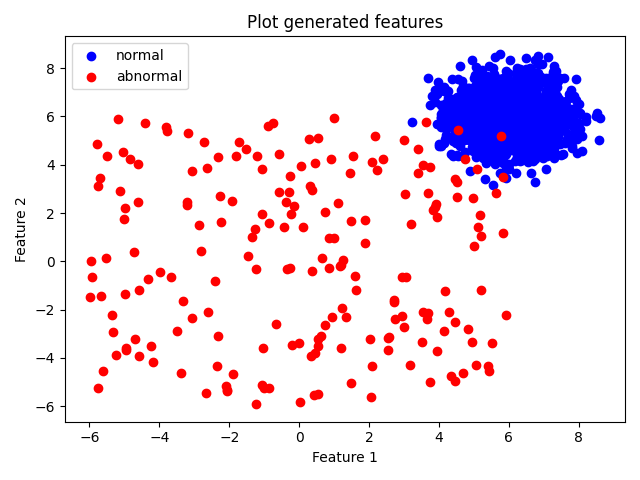
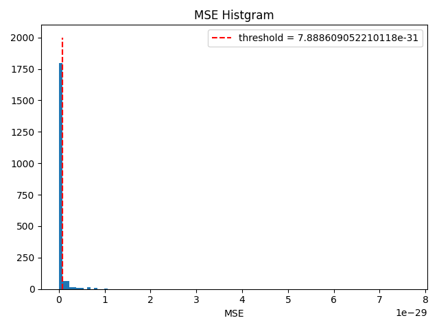

## 概要

教師なし学習を使った異常検知をやってみたいと思い
、[Pythonではじめる教師なし学習](https://amzn.to/3eM9dfF)を読んでいたらちょうど
いいお題があったのでやってみることにした

ここではサンプルデータを対象にPCAを使った異常検知を行う

なぜ検出できるのかという理論的な内容についてはここでは触れない。（というかわかっ
てない）

## アプローチ

PCAについて
は[このPDF](https://ojisan-toybox.github.io/universal-pdf-component/example.pdf)が
詳しく書いてあった

前提として、なんらかの理由で訓練データに異常標本が混ざっており、教示データを用意
できないこととする。

（専門家の方には怒られてしまう表現なのは重々承知で、）

上記の資料ではPCAは以下のように説明されている
>多次元データのもつ情報をできるだけ損わずに低次元空間に情報を縮約する方法

この性質を使って、

1. 異常標本が混ざっている多次元データ
2. 1のデータをPCAで次元圧縮し、固有値ベクトルを取得
3. 1と2のデータを使って一度次元圧縮し、復元した逆変換データを作る
4. 元データと逆変換データの差分が大きい値を異常標本として検出する

上記のような処理をすることで、一度PCAをした際に正常なデータの方が多いことが想定されるため、Fitされるベクトルが正常標本に偏りと思われる

その性質を利用して、逆変換をした際に異常標本は正常データに偏って変換されるため元データとの差分が正常標本よりも大きくなると考えられる

## PCA を使った異常検知の実装

[実装したscriptはこちら]()

### ２値分類のサンプルデータを生成

```python
from pyod.utils.data import generate_data

X_train, _, y_train, _ = generate_data(
    n_train=2000,
    n_test=0,
    contamination=0.1,  # percentage of outliers
    random_state=42,
)
```

X_trainとy_trainの中身

```text
X_train:
(2000, 2)
[[6.43365854 5.5091683 ]
 [5.04469788 7.70806466]
 [5.92453568 5.25921966]
 [5.29399075 5.67126197]
 [5.61509076 6.1309285 ]] 

y_train:
(2000,)
[0. 0. 0. 0. 0.]
```

以下は入力データの分布の画像だが、特徴量を見ても別のデータとして視認できそう


### PCA を使ってデータを逆変換

```python
import numpy as np
from sklearn.decomposition import PCA

def fit_and_inverse(data: np.ndarray, n_components: int = 2):
    pca = PCA(n_components=n_components)
    reduced = pca.fit_transform(data)
    inverse = pca.inverse_transform(reduced)
    return inverse

raw = X_train.copy()
inv = fit_and_inverse(raw)
```

### 元データと逆変換データの差分から閾値を決定

```python
mse = ((raw - inv) ** 2).mean(axis=1)

# NOTE:
# 今回は10%が異常データとして生成してるので90percentileで閾値を設ける
# 実際には想定される異常値の割合や期待する再現率などから設定すると考えられる
threshold = np.percentile(mse, 90)
```

以下の画像が標本ごとのMSEの分布と閾値になる

分布からはこれが良い閾値なのかはわかりにくいと思った



### 分類結果

|     | precision | recall | f1-score | support |
|----:|----------:|-------:|---------:|--------:|
| 1.0 |      0.91 |   0.70 |     0.79 |     200 |
| 0.0 |      0.97 |   0.99 |     0.98 |    1800 |

## まとめ

PCAを使った異常検知の手法ということで、ラベルデータがない環境下でも取れる手段としていい知見になった。

使っている手法がPCAになるのでカテゴリカルデータや元データの次元数が多い時などさまざまな場面では制約になることがあるのかなあとか思った。
