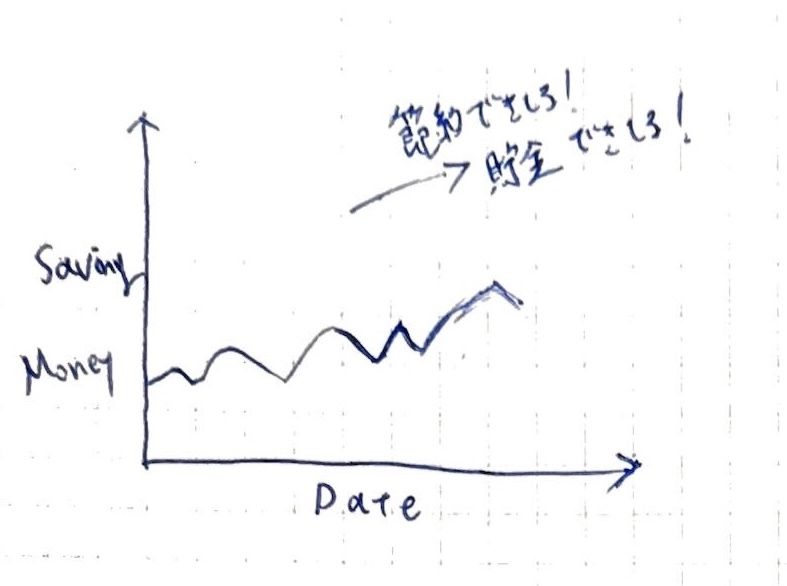
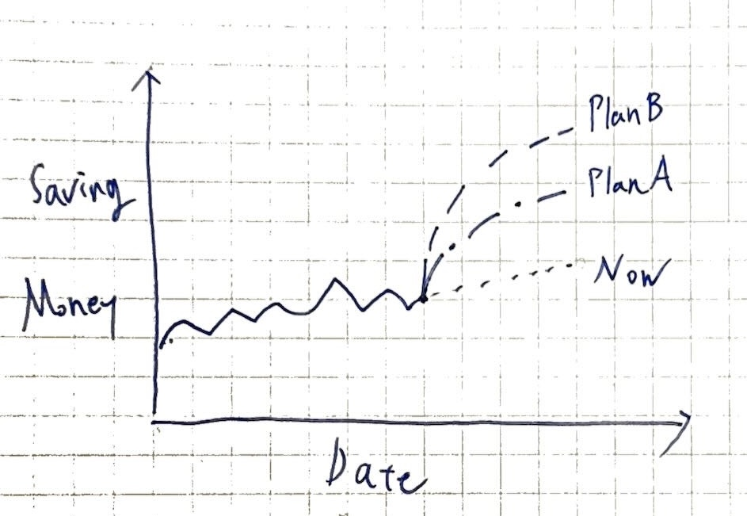

## 導入

ML Eng -> PdM というキャリアを進んでいる背景もあり、なんか機械学習を使ったいい感じの企画をしてくれよ、という話は多数耳にする。

とあるスカウトサービス経由でカード発行もやっているクレジットカード事業でそのような需要があることを耳にした。スカウトが来ただけなので働いてはいない。

率直に「何に機械学習を使えるのだ？」と思ったので少し考えてみたくなって記事を書くことにした。

## 市場を眺める

クレジットカードの発行も含んだ私が使ったことあるサービスは以下の通り。

Kyash, B4/3, Revolut, LINE Payカード

どれも物理的なカードが発行でき、相互送金ができ、B4/3のみは複数ユーザーでの利用ができる。

実際に使ってみた所感としては、クレジットカードのスケープゴートができたような感覚であり非常によかった。具体的には、

- 紛失時にアプリから利用を停止できる
- クレジットカードからのチャージによるポイントの二重取得
- 送金機能
- クレカ変更の影響の軽減(メインで使うカードは変わらないという意味)

このように個人としての利用経験もよかった。

昨今はカードレスクレジットカードやhogehoge Pay、QR決済なども増えているが、物理のクレジットカードの発行はまだまだ需要があると考えられる。
特に日本ではなぜかわからないが、クレカのタッチ決済が機能していない店舗が多数ある。

また昨今のこのような事業においては家計簿アプリとクレカが連携しているものも多い。
今回も上記にフォーカスして思考を巡らせてみる。

## 事業への理解を深める

ビジネスモデルとしてはシンプルだと思っていて大体以下の２点に落ち着くと思ってる。

- 発行したクレカの利用料金から手数料を取る
- 有料プランがある場合はその料金を取る

要は、発行したクレカを使ってもらうことが事業の成長に繋がる。
また、付加価値としてついている家計簿機能も使ってもらうことが事業の成長に繋がる。
さらにいうと、付加価値があることでクレカの利用を促進することも事業の成長に繋がる。

## 想定するサービスの前提

これはこの後機械学習の活用方法について検討するにあたる前提を揃える。

想定されるサービスは、

- プリペイド式のクレジットカードを発行できる
- サービスが提供するカードを使うと家計簿が記録される
- オプション機能
  - 送金機能
  - 複数人での利用管理
  - ポイント付与

## ユーザーが求める価値を言語化してみる（サービスが提供したい価値とも言える）

「機械学習が事業に貢献するなら」という話をするために、ユーザーが求める価値を言語化してみる。

- 支出を管理できる
- 複数人で財布をシェアできる
- 安全性が高い（カードをアプリから即時に止められるなど）

## 「価値」の定義が正として、機械学習の活用方法を模索する

私は今回「支出を管理できる」という価値にフォローカスして機械学習の活用方法を模索することにした。
きっと手札をもっと多く持っていたり、他の方が考える価値を見つけることもできる人もいるだろうと思う。

今回は１つ目の価値を「支出を管理できる」 =  **「浪費を抑え貯金できる」** と捉え直す。

まず前提としてこれを提供するために以下のようなグラフをユーザーが見れるようにするべき。

### 前提を踏まえた機能案

#### 1. 累積節約額 （ = 貯金額 ） の予測

上記に挙げたグラフを単純に回帰予測したグラフで十分

現状と何も変わらずに将来に発生する利益を見るだけで人間は嬉しくなると思う。

これだけでこのアプリをみることが楽しくなると思う。少なくとも私はwealthnavi, meneyforward, bitflyerなど資産が記録されてるアプリが右肩上がりになっているのを見て嬉しくなるし意味もなくアプリを見てしまう。

#### 2. 節約プランの提案と違反した場合のアラート

これは機械学習？というかデータ活用の見せ場になると思う。

下図のように **PlanA** , **PlanB** という節約プランを提案し、ユーザーが違反した場合にアラートを出す。

Plan毎には支出管理データをもとに、より安価な購買商品の提案、浪費を指摘などを行う。

ユーザーにとっては行動の結果が明白であり、それを実行するモチベーションが明快になる。

## 機械学習が活用されることによる事業の展開の拡張

- 定期便サービスとの連携によるまとめ買いシェア
  - 消耗品の相乗り買い（そういうサービスとの連携があるといい）
- 節約額（貯金額）のNISAや仮想通貨の自動投資
- 貯金額で旅行を提案したっていい（アフィリエイトが美味しい）
- 予想貯金額と実際の貯金額の相関をみたくなってデータを渡したくなるはず
  - ユーザーのバジェットを知れるとやれることも増えるだろうと思う

## 所感

- 「節約が楽しくなる」感情にさせたら色々うまくいく
  - 節約=貯金の構造が直感的にさせるUI/UXの設計はキモに思える
  - 思考停止での節約活動をさせたらインフラになる（それ使ってないだけで損するよ？という風潮が作れたら良い）
- MLが創出する価値により、ユーザーがデータを差し出す構図は理想
- 支出の分類精度を上げよう！とかはわかりやすいが、事業の価値に連動するプランが欲しくなる

それとこんなことを書いておいて、

- 金をもらっていないのに何をしてるんだ、という気持ちもありつつこういうのを考えるのは楽しい
- その反面、こういうことを考えるだけの仕事があったら非常にやりたい
