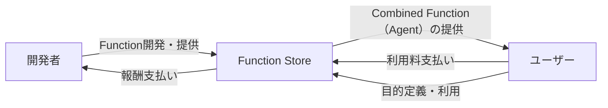

## Function Storeとは

Function Storeは、

なんらかの単一の処理やAPIエンドポイントを「Function」として提供し、

ユーザーが目的を定義すると、

エージェントが必要な「Function」を組み合わせることで、

その目的を達成することができるプラットフォームです。

主な特徴：

- プロンプトやコードで作成されたEndpointを持つ単一の処理をFunctionとして提供
- プロンプトが書ければ誰でも開発者になれる低い参入障壁
- ユーザーにはFunctionの利用量に応じた従量課金システムを採用
- 開発者には開発されたFunctionの利用料に応じた報酬システムを採用

## なぜ必要か

- 開発者エコシステムの拡大
  - プロンプトという誰でも作れるアプリを流通させるマーケットを作る
- イノベーションの加速
  - 課題定義 → 開発 → 実現のプロセスを誰でも高速に実現できるようにすることで、イノベーションのジレンマを潰す
- コスト効率の向上
  - LLMに対する多様な処理を集約することで、個々の利用に比べてハードウェア、ソフトウェアの両面からコスト効率化を目指す

## ビジネスモデル

## 類似サービスの問題点

### AppStoreの課題

- 高い参入障壁
  - アプリ開発には専門知識と多大な時間投資が必要
  - 審査プロセスが厳格で時間がかかる
- 固定的な価格設定
  - 柔軟な料金体系の設定が困難
  - 小規模な機能に対する適切な価格設定が難しい
- 大規模アプリ偏重
  - 小規模な機能や特定のニーズに特化したソリューションが埋もれやすい
- 検索の困難性
  - 多様性が上がりすぎて、マーケットからアプリを見つけることはできない
  - ランキングも流動性が悪く、参考にならない

### Zapierの課題

- 複雑な自動化設定
  - 非技術者にとって高度な自動化の設定が困難
- 限定的な統合オプション
  - 特定のサービスやアプリケーションに依存
- スケーラビリティの制限
  - 大量の処理や複雑なワークフローへの対応に制限がある
- 利用者側にメリットがない
  - 基本サブスクでコストを払うのみで、リターンはない

### GPTs（OpneAI）の課題

- 利用者がテック寄りの人間に偏ってる
  - ニッチなニーズが生まれない
- GPTs開発者への報酬がない

## 競合はあるか

まだわからない。

Appleは頑張ってくれたらいいなって思ってる。Siri + ショートカット機能がユーザーのニーズには近いと思っている。

## Function Storeの具体的な使用例

### 1. 不動産業者向け物件写真最適化システム

- ユーザー：中小規模の不動産会社
- 目的：「物件の写真をアップロードし、自動で色調整、不要物の削除、ウォーターマーク追加を行う」
- 使用するFunction：
  - 画像アップロード Function
  - 自動色調整 Function
  - 不要物検出・削除 Function（AI画像生成技術を使用）
  - ウォーターマーク追加 Function
- 結果：プロ級の物件写真を簡単かつ迅速に作成でき、物件の魅力を高められる

### 2. 飲食店向け口コミ分析ダッシュボード

- ユーザー：個人経営の飲食店オーナー
- 目的：「Google Maps、食べログ、インスタグラムの口コミを収集し、感情分析を行い、トレンドをグラフ化する」
- 使用するFunction：
  - Google Maps口コミ取得 Function
  - 食べログ口コミ取得 Function
  - インスタグラム投稿取得 Function
  - テキスト感情分析 Function
  - トレンド分析 Function
  - グラフ生成 Function
- 結果：複数プラットフォームの口コミを一元管理し、客観的な店舗評価とトレンドを把握できる

### 3. 多言語カスタマーサポートチャットボット

- ユーザー：グローバル展開を目指すEコマース企業
- 目的：「顧客からの問い合わせを自動で言語検出し、適切な言語で回答を生成。必要に応じて人間のオペレーターに引き継ぐ」
- 使用するFunction：
  - 言語検出 Function
  - 機械翻訳 Function（入力を英語に統一）
  - 意図分類 Function（問い合わせ内容を分類）
  - FAQ検索 Function
  - 回答生成 Function
  - 人間オペレーター引継ぎ判定 Function
  - 翻訳 Function（回答を元の言語に翻訳）
- 結果：24時間体制の多言語サポートを低コストで実現し、顧客満足度を向上

### 4. 個人投資家向けAI投資アシスタント

- ユーザー：副業で株式投資を始めた会社員
- 目的：「指定した銘柄の財務データと市場動向を分析し、投資判断をサポートする」
- 使用するFunction：
  - 株価データ取得 Function
  - 財務データ取得 Function
  - ニュース記事収集 Function
  - センチメント分析 Function（ニュース記事の感情分析）
  - テクニカル分析 Function
  - ファンダメンタル分析 Function
  - 投資判断生成 Function
  - 結果：プロ並みの分析と判断材料を得られ、個人投資家の意思決定をサポート

## Appendix: Function Store 構想の一枚絵

作：[unsu0707](https://github.com/unsu0707)
