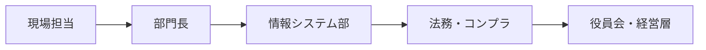
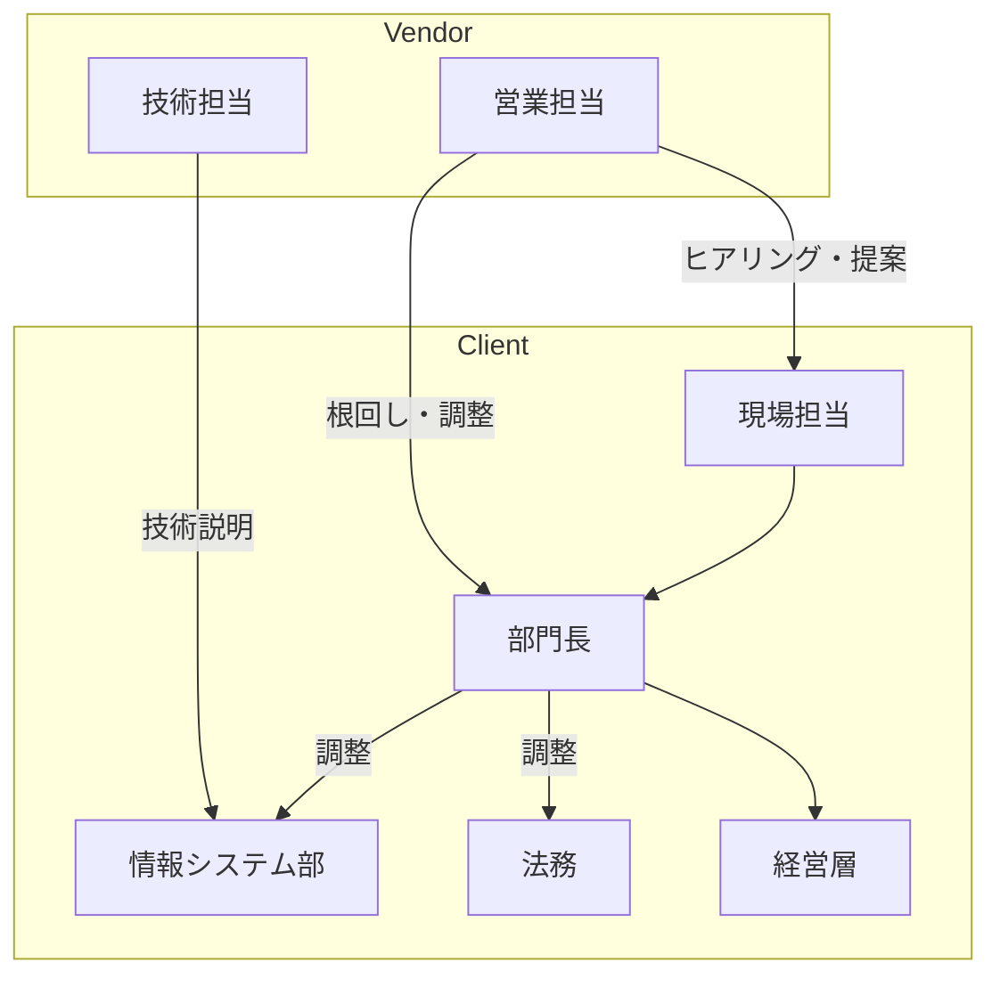
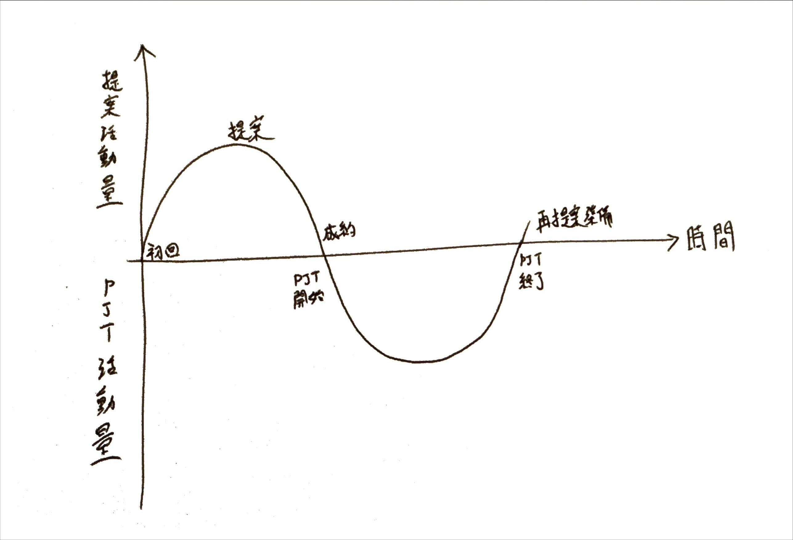

## 成約までの全体像：5つのステップ

1. **アプローチ・初回商談**  
   - 顧客との最初の接触。紹介やWeb問い合わせ、展示会など、さまざまなチャネルがある  
   - 相手企業の概要や事業分野、課題感を大まかに把握し、関係を構築し始める  
2. **ニーズ確認・課題の明確化**  
   - 顧客が抱える課題をヒアリングし、解決すべき優先度や要件を整理  
   - 顧客の想定予算や導入決定権者の有無なども同時に確認する  
3. **ソリューション提案・デモ**  
   - 明確化した課題に対して、具体的な解決策・メリットを示す  
   - デモやプロトタイプなども活用して導入後のイメージを高める  
4. **見積提示・交渉**  
   - 予算とのすり合わせ・価格交渉・契約条件の調整を行う  
   - 不安や疑問点を解消し、最終合意に近づける  
5. **クロージング（契約締結）**  
   - 契約書取り交わし、顧客企業内の稟議などをサポートし、最終決定を得る  

---

## ステップごとの規模別攻略ポイント

### ステップ1. アプローチ・初回商談

| 規模         | 主要な特徴                                                                                                                | 具体的なアプローチ                                                                                                                 |
|:------------|:------------------------------------------------------------------------------------------------------------------------|:----------------------------------------------------------------------------------------------------------------------------------|
| スタートアップ | 意思決定者に直接リーチしやすい  新規技術やスピード感重視 | トップアプローチ（代表直）  小規模PoC提案 伴走姿勢を伝える |
| 中小企業     | ITに不慣れな経営者が多い  比較的スピード決済可能 | 紹介の活用  わかりやすい表現を意識  丁寧なヒアリング |
| 大企業       | 窓口と決裁者が異なる  実績・信頼重視 | 紹介や既存ネットワークを活用  導入実績や成功事例を提示  比較検討時の優位性を強調 |

#### 信頼獲得のポイント：初回接触時

- **スタートアップ**
  - 柔軟さとスピードをアピール
  - CTOや技術責任者との早期接点づくり（技術的理解を深めるため）
  - アイデアベースの提案よりも「実現可能な範囲」の現実解を提示
  - 「他社はこうしている」という業界情報の提供で価値を示す
  - リソース不足を前提とした支援姿勢を提案（例: 開発リソース、人脈紹介など）

- **中小企業**
  - 難しい言葉を避け、信頼できる相談相手として振る舞う
  - 経営者の関心事（コスト削減・売上向上・業務効率化など）に焦点を当てる
  - 成功事例を「Before/After」で具体的に示す（理想は同業他社の事例）
  - 初回から提案ありきではなく「理解する姿勢」を徹底する
  - 業界特有の課題への理解をアピール（事前リサーチが重要）

- **大企業**
  - 担当者が社内で話しやすいような資料・実績を準備
  - 自社サービスの市場での位置づけを明確に（競合比較表など）
  - 初回面談での深掘りよりも「2回目面談の約束」を優先する戦略
  - キーパーソンマップを早期に作成（意思決定者と影響者の特定）
  - 部署間の利害関係や組織構造への理解を示す
  - 業界展示会やセミナーなどでの接点づくりも効果的

### ステップ2. ニーズ確認・課題の明確化

| 規模         | 特徴 | アプローチ |
|:------------|:------|:------------|
| スタートアップ | 変動性が高い  課題が未整理 | 短期・中長期の開発意図を明確化  将来の拡張性を提案に盛り込む |
| 中小企業     | 経営と現場のズレ  要件が曖昧になりやすい | 現場ヒアリングを重視  数値・図で課題を可視化 |
| 大企業       | 複数部署にまたがる  RFP形式も多い | 各部門の利害を把握し統合  RFPの背景や目的を確認 |

#### 信頼獲得のポイント：ヒアリング時

- **スタートアップ**
  - 経営視点で共に課題を整理
  - 「MVP」の概念を用いて現実的な範囲設定を支援
  - 優先度マトリクス（重要性×緊急性）を一緒に作成
  - 短期的な課題と長期ビジョンの両方を引き出す質問設計
  - 資金調達状況や事業フェーズに合わせた提案前提を構築
  - 技術負債を生まない設計思想を示す（将来コストの削減）

- **中小企業**
  - 現場と経営の橋渡し役として信頼を得る
  - 業務フローの可視化ワークショップを実施
  - 定量的な問題規模の特定（例: 月◯時間のロス、年間◯円のコスト）
  - 経営者と現場担当者の双方を含めた合同ヒアリングの設定
  - 競合他社や業界標準との比較データの提供
  - 困りごとから始め、徐々に解決策イメージへと誘導する質問設計

- **大企業**
  - 横串を通す形でヒアリング、社内調整を支援
  - 部門間の優先度の違いを可視化して調整（合意形成ツールとして）
  - RFPの「行間を読む」スキル（明文化されていない真の課題を特定）
  - 既存システム構成の詳細把握と連携ポイントの特定
  - ステークホルダー分析と根回し戦略の立案支援
  - 政治的な力学を考慮した提案準備（反対派への対応戦略含む）
  - 外部環境要因（規制変更・業界動向）の分析と提供

### ステップ3. ソリューション提案・デモ

| 規模         | 特徴 | アプローチ |
|:------------|:------|:------------|
| スタートアップ | シンプルな提案を好む  試せるものに価値を感じる  リソース制約（時間・資金・人材）あり | MVP提案  デモ環境で導入後を想像させる  「共創」の姿勢を示す |
| 中小企業     | ROIを重視  合理的な説明に納得すれば決定は早い  IT導入への不安感が強い | 数字を用いた説得  スケジュール・体制も説明  効果の「見える化」徹底 |
| 大企業       | システム連携・リスク重視  複数部門の利害調整が必要  セキュリティ・コンプライアンス要件厳格 | 大規模開発実績を提示  リスク低減策を明示  社内説明支援資料の充実 |

#### 信頼獲得のポイント：提案・デモ時

- **スタートアップ**
  - スモールスタートと将来拡張性の両方を提示
  - 「一緒に作り上げる」共創姿勢を強調
  - 最初の2週間で形になるデリバラブルを明確化
  - 同フェーズ企業での成功体験（失敗から学んだ知見も）を共有

- **中小企業**
  - 「毎月◯時間の削減」など具体的数値で効果提示
  - 「最初の1ヶ月」「3ヶ月後」など段階的な変化イメージを視覚化
  - 同業種・同規模企業の導入事例を詳細に共有
  - 経営者が現場に説明しやすい資料を提供

- **大企業**
  - セキュリティ認証・監査体制の詳細提示
  - 提案先担当者が社内説明で使える資料の提供
  - 想定されるリスクとその対応策一覧を準備
  - プロジェクト体制図と役割分担の明確化

### ステップ4. 見積提示・交渉

| 規模         | 特徴 | アプローチ |
|:------------|:------|:------------|
| スタートアップ | 資金調達状況に依存  価格より効果重視の傾向も | 小さく始める提案と拡張可能性の提示  段階導入 |
| 中小企業     | 明確な上限予算あり  値下げ要望あり | ROIシミュレーション  ライトプラン・段階導入 |
| 大企業       | 契約内容・項目精査が厳格 | コスト内訳の提示  契約条件の準備と法務対応を意識 |

#### 信頼獲得のポイント：交渉時

- **スタートアップ**
  - 資金調達状況やバーンレートを考慮した段階的な投資プラン提案
  - 「最低限必要な部分」と「あったら良い機能」の明確な切り分け
  - 最初の3ヶ月でのROI可視化を重視（投資回収の早期化）
  - コアとオプション機能の分割提案（拡張可能性を担保）
  - 低コストで始め、成果に応じて段階的に投資増やす「成功報酬型」提案
  - 共同プロジェクトとしての位置づけ（リスク・リワード共有モデル）
  - 契約内容より「成果物」「プロセス」に重点を置いた説明

- **中小企業**
  - 初期投資と月額運用コストの明確な切り分け
  - 数値で示すROI試算（「年間◯百万円のコスト削減」など）
  - 競合見積もりとの比較ポイントを先回りして説明
  - 「予算内で最大の効果」を出すための機能調整案の提示
  - 同業他社での導入事例とコスト感の共有（参考指標）
  - 値引きよりも「サービス追加」で価値向上を図る交渉術
  - 経営者の関心事（売上増・コスト削減・リスク低減）に合わせた説明

- **大企業**
  - 予算策定のタイミングを把握し、年度計画に組み込める提案
  - コスト構造の透明化（人件費・ライセンス費・保守費など）
  - 見積内訳の詳細化と根拠説明（担当者の社内説明用）
  - 法務・調達部門が指摘しそうな点を先回りして補足説明
  - 複数年契約のメリット提示（年間コスト削減など）
  - SLAなど契約条件の明確化と対応可能範囲の提示
  - 競合製品との詳細比較表の提供（選定根拠の強化）
  - 将来的な拡張性・スケーラビリティの説明

### ステップ5. クロージング（契約締結）

| 規模         | 特徴 | アプローチ |
|:------------|:------|:------------|
| スタートアップ | 意思決定は早いが方針転換もある | 最終確認を頻繁に  導入後の効果を再共有 |
| 中小企業     | 経営者が納得すればスムーズ | 経営層の不安解消に集中  サポート体制も示す |
| 大企業       | 稟議・法務プロセスが複雑 | 稟議資料の支援  セキュリティやコンプラ対応も抜かりなく |

#### 信頼獲得のポイント：契約締結時

- **スタートアップ**: こまめな進捗共有で安心感
- **中小企業**: サポート含めた「頼れる存在」になる
- **大企業**: 稟議通過を支援する「社内代理人」的な動き

---

## 大企業・外資系の意思決定プロセス可視化

大企業や外資系企業では、意思決定プロセスが複雑で多段階になることが多いです。キーパーソンや承認フローを可視化することで、営業戦略の立案や根回しがしやすくなります。

### 典型的な意思決定フロー（例：flowchart）

- **現場担当**: 実務上の課題や要件を整理
- **部門長**: 部門予算やリソース配分を決定
- **情報システム部**: 技術要件・システム連携・セキュリティ審査
- **法務・コンプラ**: 契約・規約・リスクチェック
- **役員会・経営層**: 最終承認

#### キーパーソンマップの例

---

## ROI・ビジネスケースの定量例

ROI（投資対効果）やビジネスケースを定量的に示すことで、顧客の納得感や説得力が高まります。

### ROI計算のサンプル

- **ROI（%） = （年間コスト削減額 − 年間投資額） ÷ 年間投資額 × 100**

#### 例

| 項目             | 金額（円） |
|:----------------|:----------|
| 年間コスト削減額 | 3,600,000 |
| 年間投資額       | 1,200,000 |
| ROI             | (3,600,000-1,200,000)/1,200,000×100=200% |

### 投資回収期間（Payback Period）

- **投資回収期間 = 初期投資額 ÷ 年間コスト削減額**

#### 例

| 項目         | 金額（円） |
|:------------|:----------|
| 初期投資額   | 2,000,000 |
| 年間削減額   | 1,000,000 |
| 回収期間     | 2,000,000 ÷ 1,000,000 = 2年 |

---

## クロージング後のフォローアップ

契約締結後のフォローアップは、顧客満足度の向上やリファレンス獲得、追加受注につながる重要な活動です。

### フォローアップのポイント

- **カスタマーサクセスの徹底**
  - 導入後の定期的な進捗確認・課題ヒアリング
  - 利用状況の可視化・活用促進サポート
  - トラブル時の迅速な対応
- **リファレンス獲得**
  - 成功事例インタビューや導入事例の公開依頼
  - 顧客の声を新規営業やプロダクト改善に活用
- **追加提案・アップセル**
  - 利用状況に応じた新機能・追加サービスの提案
  - 顧客の成長や変化に合わせた継続的な提案

---

## まとめ

- 成約プロセスは共通だが、**各ステップの対応は企業規模で調整すべき**
- **スタートアップ**: スピードと柔軟性、技術伴走が鍵
- **中小企業**: 分かりやすさと費用対効果で納得感を得る
- **大企業**: 実績と体制、社内調整支援で信頼を獲得

→ **購買プロセスに寄り添い、各規模に最適な手を打つ**ことで、成約率は確実に上がる。

> **まとめの補足**
>
> - 大企業・外資系では「意思決定フローの可視化」と「根回し」が成約率向上の鍵
> - ROIやビジネスケースは定量的に示すことで説得力が増す
> - クロージング後のフォローアップがリファレンス獲得や追加受注につながる

## Appendix

### 営業サイクルのイメージ図

