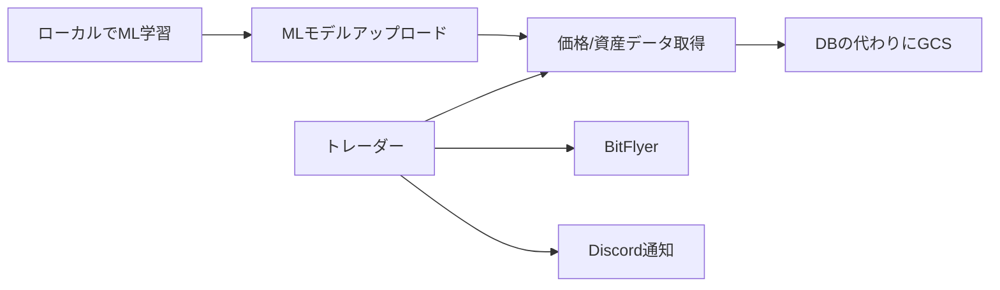

# タンス預金仮想通貨bot

## TL;DR

- バックテストでは利益が出るbotを作成
- GCPを使って実運用を実現
- CryptoBot開発をkaggle風問題設定に落とし込んだ
- 今後は強化学習モデルも検討中

## モチベーション

- NISA運用で「放置して稼ぐ」魅力に気づく
- 自動で資産運用してくれるbotに可能性を感じた
- API利用可能な仮想通貨で実験開始
- コンセプト：「放置して儲ける」高頻度取引bot

## 学習リソース

- 参考にした書籍
  - 「ファイナンス機械学習」
  - 「Pythonではじめるアルゴリズムトレーディング」
  - 「Pythonで学ぶ強化学習」
  - 「日給300万円のSS級トレーダーが明かす botterのリアル」

## 実装ステップ

1. 価格データの定期取得
2. ランダム取引botの作成
3. 評価環境の構築
4. 機械学習モデルの導入（ChatGPT活用）
5. ランダムエージェントとの比較
6. ローカルでの実取引テスト
7. Discord通知連携
8. クラウド環境での運用開始

## システム構成

## 気づき・考察

- シンプルなMLOps体験
- 小資金でも心理的影響は大きい
- GCPの柔軟性が個人開発に適している
- 強化学習への可能性
- 時間管理の難しさ

## 強化学習の試み

- やったこと
  - 仮想通貨botを強化学習で作成
  - モデル学習のためにランダム取引botでデータを作成
  - 報酬設計は「利益率」（売却額 - 購入額 - 手数料）を使用
    - また、取引すること自体にも報酬を与えた（利益を産む機会にtryしたことを評価したいため）
- 結果
  - 取引をしないエージェントが出来上がった
- 考察
  - ランダム取引では、利益が出る取引が生まれなかった（よく考えたら当たり前）
  - つまり、ある程度利益が出る取引ルールを持ったbotを作れないと強化学習には踏み切れない

## 今後の展望

- 強化学習モデルの導入
  - 上記の試みを踏まえ、まず利益が出る取引ルールを持ったbotの開発に注力
  - 十分なデータ収集後に再度強化学習を試みる
- データ収集とモデル改善サイクルの確立
- 運用効率の向上
