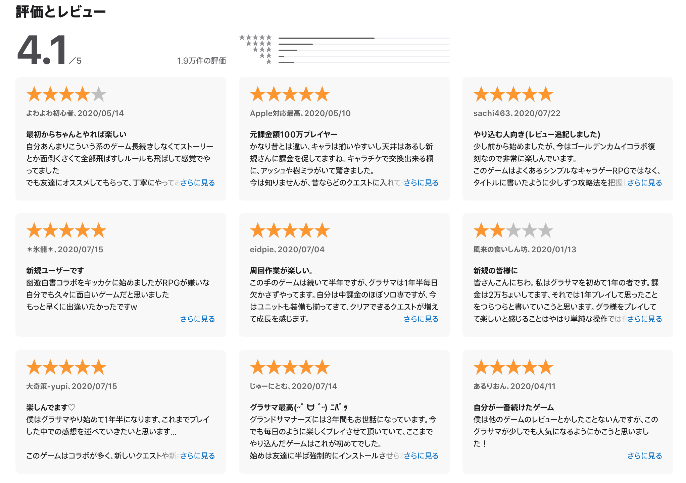
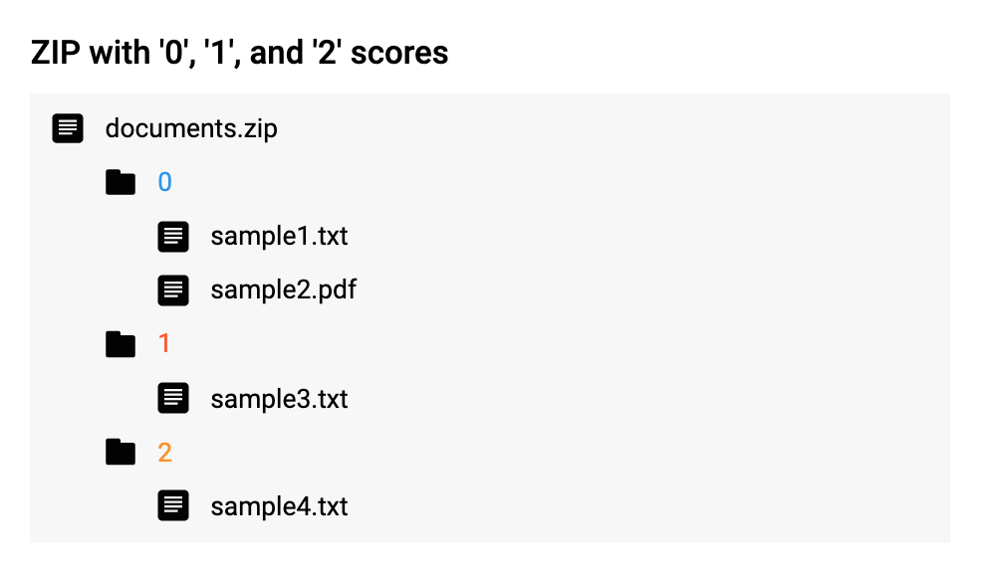
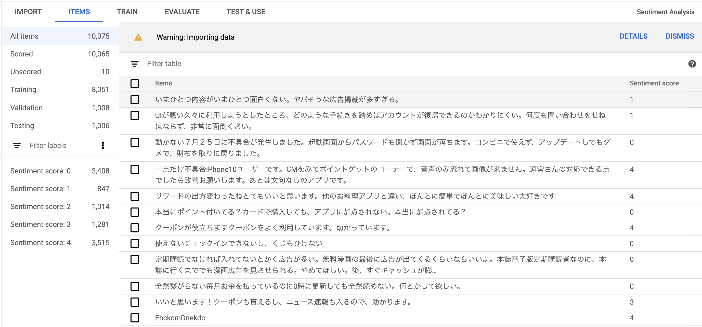
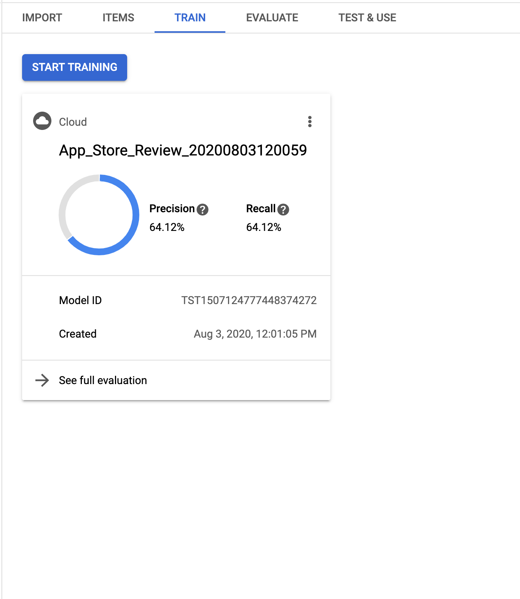
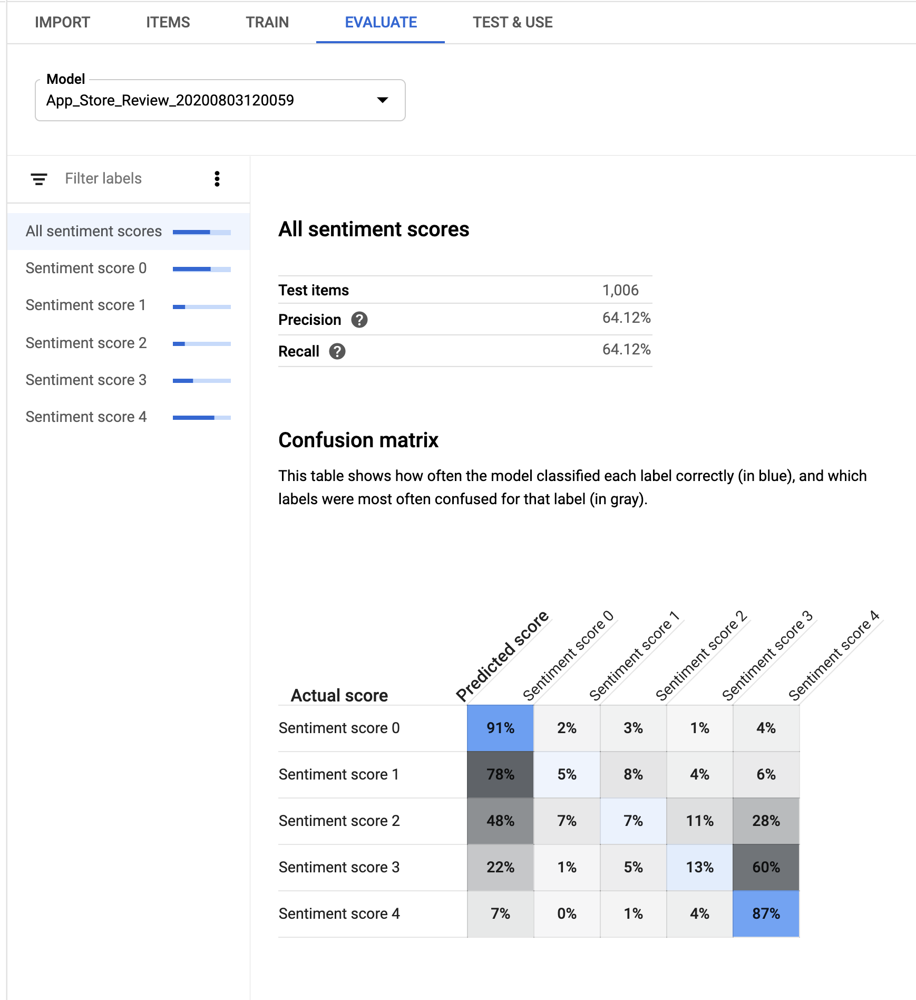
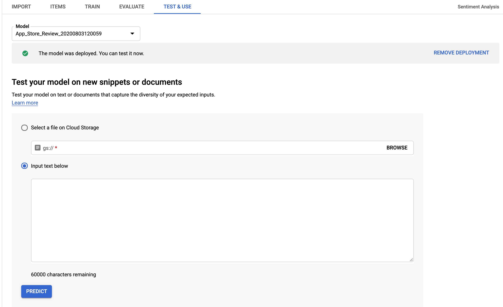

<!-- theme: default -->
<!-- size: 16:9 -->
<!-- page_number: true -->
<!-- paginate: true -->

<!-- auto-scaling: true -->

# AutoML 使ってみた

---

# ToC

- ML プロジェクトのプロセス
- ML プロジェクトににおける課題
- なぜ AutoML をやるのか
- AutoML の紹介（202008 時点）
- 先行事例
- やったこと
- まとめ

---

# ML プロジェクトのプロセス

- 企画
- 机上検証
- 実証実験
- システム開発
- システム運用

だいたいこんな感じ

---

# ML プロジェクトにおける課題（の一部）

主に机上検証・実証実験における課題

- データの質・量がよろしくない
- コードの品質が悪い
- 適切なモデルをつくることが難しい

---

# なぜ AutoML をやるのか

- データの前処理やクレンジングを担ってくれるのか
- コードの質を気にせずにモデルをつくることができるのか
- 適切なモデルというの確かめることができるか

これらを AutoML が解決できるのかを確かめる。

---

# GCP AutoML の紹介（2020/08 時点）

- AutoML Vision（画像分析）
- AutoML Video Intelligence（動画分析）
- AutoML Natural Language（自然言語処理） <- 今回はこれやる
- AutoML Translation（翻訳）
- AutoML Tables（構造化データの分析）

---

# 先行事例

- 画像分類
  - [LIFULL, 物件画像の分類](https://cloud.google.com/blog/ja/topics/customers/automl-lifull)
  - [cookpad, 商品画像の分類](https://speakerdeck.com/chie8842/kutukupatudoniokerucloud-automlshi-li)
- その他事例
  - https://cloud.google.com/automl?hl=ja
- , etc

---

# やったこと

- GCP Natural Language AutoML を使う
- データの取得
- データの加工
- AutoML にデータを投入
- データが読み込まれる

---

## GCP Natural Language AutoML を使う

- エンティティの抽出
- コンテンツ分類
- 感情分析 <- 今回はこれやる

---

## データの取得

- 右の画像のようなレビューデータを GAS でクローリング
  - Spredsheet に保存
- 全部で 22 アプリのレビューデータを取得
- ジャンルは、EC, Game, 人材, 漫画などなど

---

## データのラベル付け

- 今回はレビューデータを使うので、あらかじめ星が付いてる。
- したがって、ユーザーが付けた星を正とする。

### ラベルデータがないなら

- 自分でラベルを付ける。
- AutoML Natural Language UI（Data Labeling）などを活用する。
- [AI Platform Data Labeling Service](https://cloud.google.com/data-labeling/docs) を使用して人間のラベル付け担当者に依頼する。

---

## データの加工

- 収取したレビューデータを AutoML が望む形に加工する必要がある。
- いくつかある中で、今回は右のようなフォーマットを選択。
  - ✗: 1 label - 1 file
  - ○: 1 record - 1 file

Source: https://github.com/konumaru/sentiment_analysis/blob/master/main.py

---

## データの投入（Items）

---

## Train

- ワンクリックで実行できる。
- 学習用データ・評価用データをよしなに分割してくれる。
- 学習は何度も実行でき、モデルごとに Unique_ID が割り当てられる。
- 評価用データにおける精度を確認できる。
- 学習用データの精度がみれないので、過学習の判断ができない。

---

## Evaluate

- 評価用データの評価結果が見れる。
- 評価用データのラベルごとの数がわかる。
- 評価結果では、Confusion Matrix もみることができる。

---

## Test & Use

- 簡易的に未知のデータを使って予測することができる。
- 勝手に REST API も作ってくれる。
- 上記を呼べるような python スクリプトの例も出してくれる。

---

# Pros / Cons

---

## Pros

- 決まったデータさえあれば予測モデルから API までつくれる。
- GUI でデータのクレンジングができる。
- GUI で予測結果を探索できる。インタラクティブで楽しい。
- （良し悪しはあるが）学習・評価データを勝手に分割してくれる。

---

## Cons

- 問題設定が限られるので使い所が難しい
- データの前処理が必要なので no code という訳にはいかない。
- データの前処理が結構たいへん（ここが一番 Auto になってほしいな...）
- 自作する場合よりもモデルの解釈が難しい。
- 過学習が判断できない。

---

# まとめ

- 基本的には便利
- 机上検証・実証実験における課題のうち、コードにまつわる課題は解決されている。

一方で、

- 使い所が限られる。
- モデルの解釈・分析が難しい。
- データの前処理は相変わらず大変。

色々あるが、
今後大いに期待できるツールになるはず。

---

# おまけ：本当に感情分析するなら

- 感情というあいまいな情報を抽出しようという試みなのでどこかで妥協が必要
  - 機械的な分析を諦め、定性分析を行う
    -> [tensorflow embedding](http://projector.tensorflow.org/?hl=ja)
  - 機械的な分析を諦められないなら
    -> 分散表現を獲得し、k-means などでクラスタリングした後、スコアリングするとか？
    （しかし、ものすごくうまく動くことは期待できないと思う）
