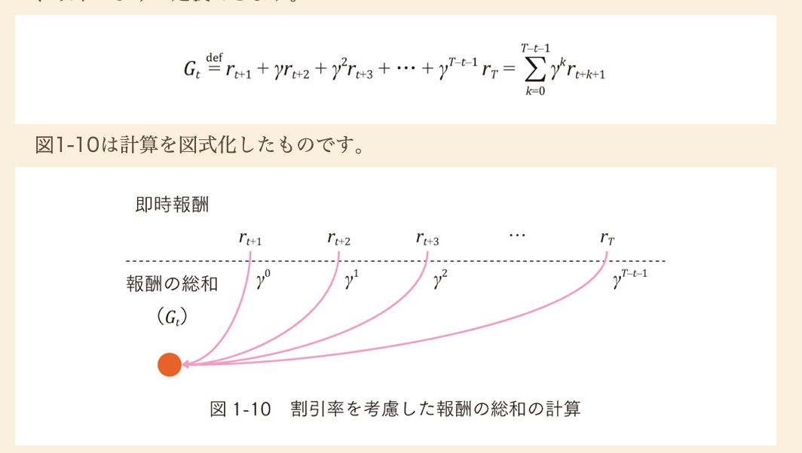
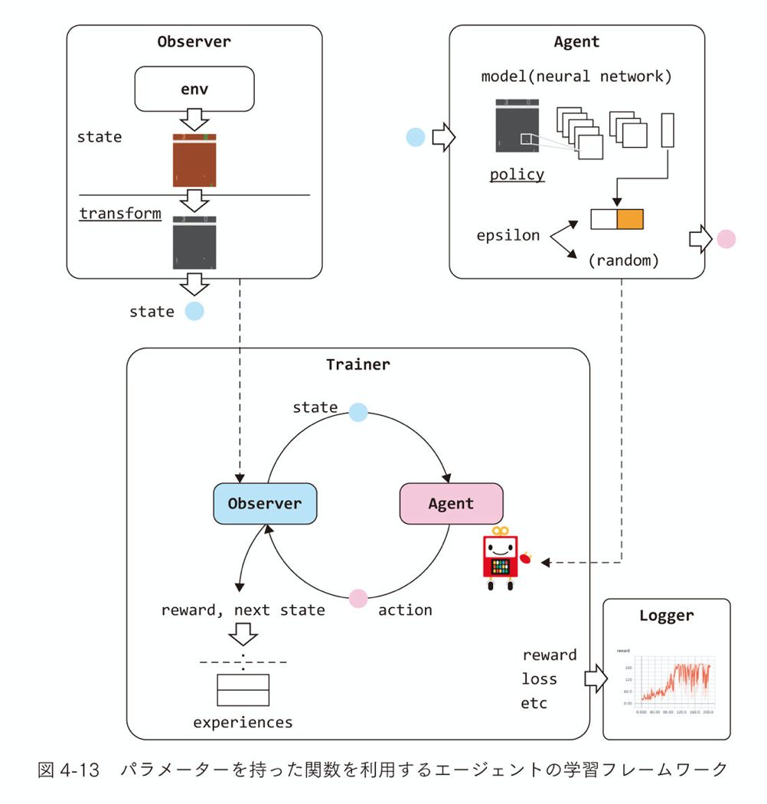
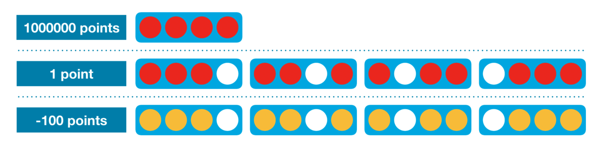
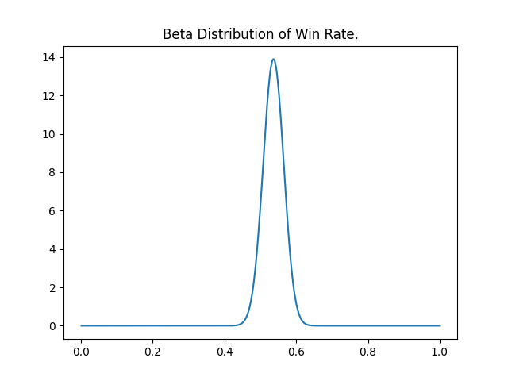
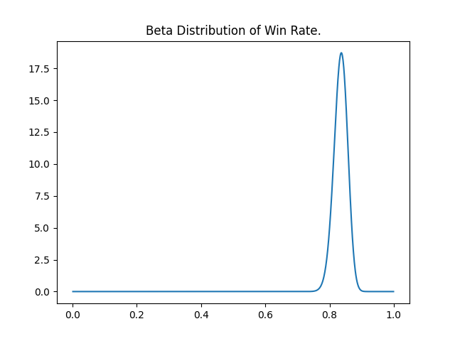

<!-- theme: default -->
<!-- size: 16:9 -->
<!-- page_number: true -->
<!-- paginate: true -->
<!-- headingDivider: 1-->
<!-- auto-scaling: true -->

# ７日で学んだ強化学習

# 7 日間でやったこと

- 書籍
  - 機械学習スタートアップシリーズ　 Python で学ぶ強化学習　［改訂第２版］　入門から実践まで
  - つくりながら学ぶ！深層強化学習 PyTorch による実践プログラミング
- 手を動かすやつ
  - Pytorch, REINFORCEMENT LEARNING (DQN) TUTORIAL
  - kaggle, Intro to Game AI and Reinforcement Learning
  - Youtuve, Deep Q Learning with Pytorch (Tutorial) - Part 1 - The Deep Q Network（Part I ~ III まである）

（ Q-Learning ってなに？という状態から ）
Python で学ぶ強化学習 と Youtube の動画内容を写経 が一番勉強になった。

# 強化学習(Reinforcement Learning)とは

ある環境があり、行動により何らかの報酬が得られるものとする。
そこでの累積報酬を最大化する行動を学習する手法。

強化学習は、教師あり学習・教師なし学習と並び、機械学習における学習方法の１つ。
（教師あり学習との勝手の違いに結構頭を悩まされた。）

# 活用事例

画像貼って、１ページずつにしてもよさそう

- 2D ゲーム
  - [DeeMind](https://deepmind.com/blog/announcements/deepmind-and-blizzard-release-starcraft-ii-ai-research-environment)
- 囲碁
  - [DeepMind, AlphaGo](https://deepmind.com/research/case-studies/alphago-the-story-so-far)
- 自動運転
  - [WAYVE](https://wayve.ai/)
  - [DeNA, 日産](https://easy-ride.com/)
- ロボット制御
  - [Google](https://ai.googleblog.com/2020/04/exploring-nature-inspired-robot-agility.html)
- 広告配信
  - [CA](https://developers.cyberagent.co.jp/blog/archives/25099/)

# 強化学習のアイディア

## Bellman 方程式

$$
G(s_t) = r_{t+1} + G(s_{t+1})
$$

現在からの累積報酬を表す式。

（この[記事](https://qiita.com/triwave33/items/5e13e03d4d76b71bc802)がわかりやすかった。）



# 学習に必要なもの

- Observer：環境を監視・操作する役割を持つ
  - Enviroment：学習対象となる環境
- Agent：報酬が最大となるような Action を選ぶ
- Trainer：Observer と Agent を利用し、学習を行う

# 学習の仕組み



1. Enviroment から State を得る
2. Agent が State から Action を決定する
3. Action から Reward, Next_State を得る
4. Next_State で得られた累積報酬 と 獲得可能であった最大累積報酬 との差分を学習する

（Python で学ぶ強化学習から引用）

# 学習できること

### 行動を評価する

- 最も価値が高い行動を選択するように学習する。
- モデルが選んだ行動から得られる報酬と環境から得られる最大の報酬の差を評価する。

### 戦略を評価する

- 戦略に基づいて行動を選択するように学習する。
- 行動確率から価値を計算し、戦略を評価する。

# 学習における工夫

- Fixed Target Q-Network
  - 始めの方は学習が安定しないため、一定期間は固定したパラメータから価値を算出する手法
- Experience Replay
  - Agent が学習する際、保存した行動履歴からランダムサンプリングする手法
  - Agent の連続した行動履歴をそのまま学習すると学習が安定することが知られている。
- 報酬の Clipping
  - 成功を１、失敗を − １など統一した報酬を定義する。
  - 一方で、特に良い行動などの報酬に重みをつけるメリット失う。

# 強化学習については大体こんな感じ

ここまでの説明で、なんとなく強化が強化学習がどういったものなのか説明しました。

ここからは、具体例を元に説明します。

# 具体例, kaggle connect X

https://www.kaggle.com/c/connectx

## Rules

https://www.kaggle.com/c/connectx/overview/environment-rules

## Getting Started

https://www.kaggle.com/ajeffries/connectx-getting-started

# どうやって解くのか

大きく分けて、２つある。

- [ルールベース解く](https://www.kaggle.com/yegorbiryukov/connectx-rule-based)
- モデルを作る
  - [Q-Learning](https://www.kaggle.com/phunghieu/connectx-with-q-learning)
  - [DQN](https://www.kaggle.com/phunghieu/connectx-with-deep-q-learning)
  - , etc

今回は、DQN をやりたかったので DQN で問題を解いている。
（本当はデバックの観点などから、
ルールベース -> Q-Learning -> DQN とステップを踏むのがよい）

# どうやって強くする？

- 累積報酬の最大化には右図の仕組みを使って学習をする。
- 最大となる報酬をどのように引き上げるのか。
  

# 素人が考えた強くする方法

- さらに高度なモデルを使う, ex:)https://github.com/pfnet/pfrl
- 特徴量を増やす
- 報酬設計を変える
- もっと長い期間学習させる
- シュミレーションの相手を強くする
- 先行 or 後攻どちらも学習させる

あたりが思いつき、とりあえず「報酬設計を変える」を試した。

# 最初に与えていた報酬

```
def custom_reward(self, state, reward, done):
  # Clipping
  if done:
    if reward == 1:  # 勝ち
      return 1
    elif reward == 0:  # 負け
      return -1
    else:  # 引き分け
      return 0
  else:
    return -0.05  # 勝負がついてない
```

# 追加した報酬

https://www.kaggle.com/alexisbcook/one-step-lookahead


# 追加した報酬の code

```
def custom_reward(self, state, reward, done):
  my_mark = state['mark']
  enemy_mark = state['mark'] % 2 + 1

  board = np.array(state['board']).reshape(self.num_column, self.num_row)

  # Clipping
  if done:
    if reward == 1:  # 勝ち
      return 10000
    elif reward == 0:  # 負け
      return -10000
    else:  # 引き分け
      return 0
  else:
    score = -0.05
    # Vertical
    # Check Own Vertical win patterns
    patterns = np.array([
      [True, True, True, False],
      [True, True, False, True],
      [True, False, True, True],
      [False, True, True, True],
    ])
    for pattern in patterns:
      score += self.check_spot_pattern(board, pattern, my_mark, mode='v')
    # Check Enemy Vertical win patterns
    for pattern in patterns:
      score -= 100 * self.check_spot_pattern(board, pattern, enemy_mark, mode='v')
    # Horizontal
    # Check Own Horizontal win patterns
    pattern = np.array([False, True, True, True])
    score += self.check_spot_pattern(board, pattern, my_mark, mode='h')
    # Check Enemy Horizontal win patterns
    score -= 100 * self.check_spot_pattern(board, pattern, enemy_mark, mode='h')

  return score
```

# 改善の評価

自分は、beta 分布を使ってやっている。

- 左が勝敗のみを報酬にしたとき
- 右が勝敗+３つ並ぶことを報酬に加えたとき




# 報酬の改善は他にもある。

- 斜めに３つ揃ったとき
  - -> 縦横よりは弱いがプラスの報酬
- 相手が４つ揃いそうなときにブロックしたとき
  - -> 強いプラスの報酬
- 揃う見込みが薄い場所に落としたとき
  - -> マイナスの報酬
