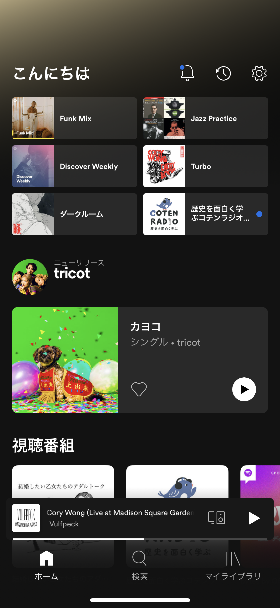
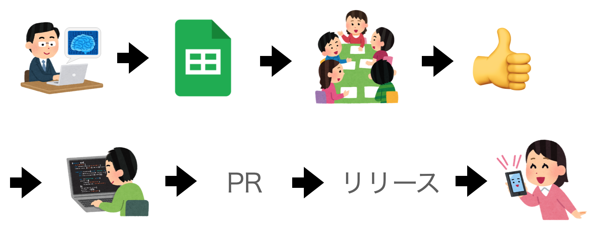
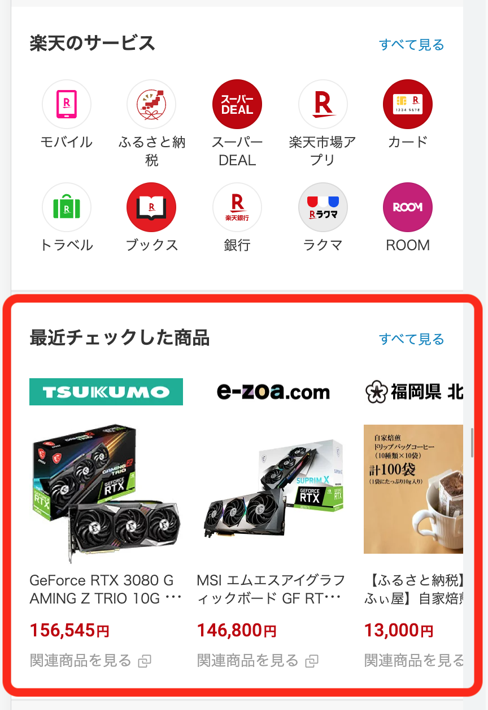
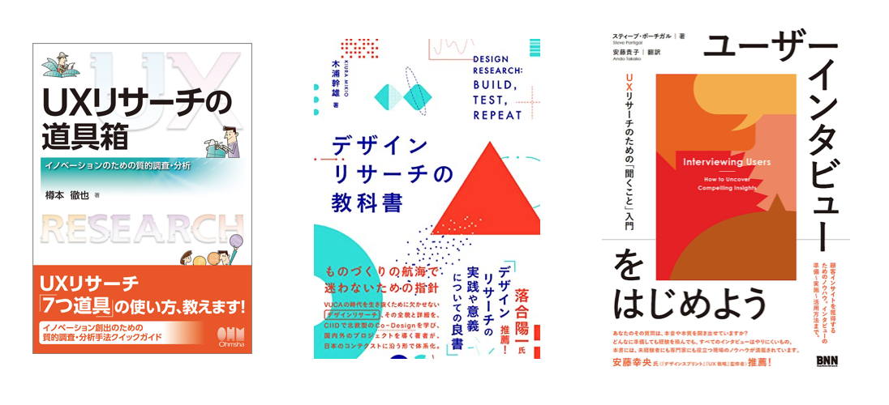

<!-- theme: default -->
<!-- size: 16:9 -->
<!-- page_number: true -->
<!-- paginate: true -->
<!-- headingDivider: 1-->
<!-- auto-scaling: true -->

# レコメンドエンジンを Figma で爆速 UX リサーチ

# ToC

- プロトタイピングとは
- プロトタイピングはなぜ必要？
- 既存のプロトタイピング
- 既存のプロトタイプへの色々
- なぜ Figma だったのか
- 完成図のデモ動画
- ユーザーテストの全体像
- これからやっていきたいこと
- まとめ

# 自己紹介

- konumaru
  - [@knmr_u](https://twitter.com/knmr_u)
- 簡単な経歴
  - データサイエンティストとして SaaS の会社に新卒入社
    - いつの間にか PdM やる
  - 今は CGM の会社で PdM
- ダイパ世代なので最近は :arrow_right: で夜な夜な思い出に浸ってる

# プロトタイピングとは

> プロトタイピング（Prototyping）とは、実働するモデル（プロトタイプ）を早期に製作する手法およびその過程を意味する。その目的は、設計を様々な観点から検証する、機能やアイデアを形にすることでユーザーから早めにフィードバックを得るなど、様々である。

「プロトタイピング」Wikipedia より

## 要するに、試作品作って早い段階でわからないことを減らそうねってこと

# プロトタイピングはなぜ必要？①

## こんなメリットがある

- 作りたいもののイメージを具体的に持てる
- 関係者間での認識を合わせやすい
- 想定していなかった問題に早期に気がつける
- 高い精度のユーザーの声を聞ける, etc

# プロトタイピングはなぜ必要？②

## デメリットもある

- 既存のシステムを汚してしまう
- プロトタイプに夢中になって完成しない
- 既存のシステムとはかけ離れたものを作ってしまう
- プロトタイピングが目的になる, etc

# 今回のお題

## 「ホーム画面に出るコンテンツのもっといい感じにして欲しい」

こういうの :arrow_right:

# 既存のプロトタイピング

# 既存のプロトタイピングへの色々

- アイディアから実現までのリードタイムを短くしたかった
  - 現状だと短くても１ヶ月はかかる見積もり
- 本番環境へのリリースとなるため、実験も開発も安全な択を選びがち
  - 検証をするなら大きな変更をするほうが新たにわかることが多い（はず）
- レコメンドエンジンの改善アイディアが出る量とそれを検証できるスピートが一致しない
  - アイディアはたくさんあるのにプロダクトへの実装が大変で積みがち

とかとか

# なぜ Figma だったのか

- 以下の要件を満たしてたから
  - UI を手軽に作れて触れる
  - spreadsheet のデータを UI に反映できる

他にも、STUDIO,miro あたりを検討した

# 試しみやってみる

# お題：楽天市場をプロトタイピングする

赤色で囲まれたこの部分だけやる

Figma の[Google Sheets Sync](https://www.figma.com/community/plugin/735770583268406934/Google-Sheets-Sync)という Plugin を活用する

# 完成図のデモ動画

GeForce RTX 3080 の値段を 100 円にしてみます

[YouTube へのリンク](https://www.youtube.com/watch?v=STE7Basj82U)

＊ SpeakerDeck からはリンクに飛べなかったので Description にリンクを載せました
（下にスクロールしたらリンクが出てきます）

# ユーザーテストの全体像

- ホーム画面のデザインは Figma で一度作ってしまえば修正の手間はほぼ０
- 実際のプロダクトではないがほぼ近い形で feedback が得られる
- モデルの修正は spreadsheet の時点で分離しているので独立して開発できる

# 細かい UX リサーチの作法はこのあたりが参考になる

# これからやっていきたいこと

- ユーザーインタビューの仕組み化
- 効果検証の計測の仕組みづくり
- レコメンドエンジンの改善と UI の改善の分離

など

# まとめ:hammer_and_pick:

実現手段はなんでもよくて、
最も早くユーザーが見れて触れるプロトタイプを作ることが重要

だし、そういうものづくりのほうが圧倒的に楽しい

# 参考資料

- [「スピード」と「品質」のスイッチング ～事業成長を支える生存戦略～ #devsumi](https://speakerdeck.com/yuzutas0/20210218c1)
- [デザインリサーチの教科書](https://www.amazon.co.jp/dp/B08MZQ9X1B)
- [ユーザーインタビューをはじめよう ―UX リサーチのための、「聞くこと」入門](https://www.amazon.co.jp/dp/4802510586)
- [UX リサーチの道具箱 イノベーションのための質的調査・分析](https://www.amazon.co.jp/dp/B07CPY4WWY)
