<!-- theme: default -->
<!-- size: 16:9 -->
<!-- page_number: true -->
<!-- paginate: true -->
<!-- prerender: true -->
<!-- headingDivider: 1-->
<!-- auto-scaling: true -->

<!--
今回の進め方
- 伝えたいことを最大３つ書く（slideの最後のまとめのイメージ）
- 目次を書く
- 箇条書きでスライドの内容を書く
 -->

# バイアスのあるデータを IPW で補正して Uplift Modeing をやってみた

# 自己紹介

- 小沼 塁, [@knmr_u](https://twitter.com/knmr_u)
- 職業とか趣味とか
  - 機械学習エンジニア
  - PM に鞍替え中
  - kaggle, 銅 1 (だけ)

# 話す内容

## テーマ

- バイアスのあるデータを IPW で補正して Uplift Modeing をやってみたよ

## TL;DR

- Uplift Moddeling で介入効果を最大化できるよ
- バイアスのあるデータでも Uplift Modeling ができたよ
- ただし、傾向スコアをあまり信じすぎるのは危ないよ

# 参考資料

- 仕事で始める機械学習
- 岩波データサイエンス vol.03

# 実装について

- 自作ライブラリ [pycalf](https://github.com/konumaru/pycalf) を作りました
- 今回の実装については上記のライブラリにまとまっています

# ToC

1. Uplift Modeling による介入効果の最大化
2. Uplift Modeling の弱点
3. IPW (Inverse Probability Weighting) とは
4. IPW で Uplift Modeling の弱点を補填
5. バイアスを補填した Uplift Modeling の結果
6. IPW (傾向スコア) の弱点
7. おまけ

# Uplift Modeling による介入効果の最大化

# Uplift Modeling の目的

- 何らかのマーケティング施策を想定する
- 右図のような四象限を仮定する
- Uplift Modeling では、介入することで CV する群である「説得可能」を見つける

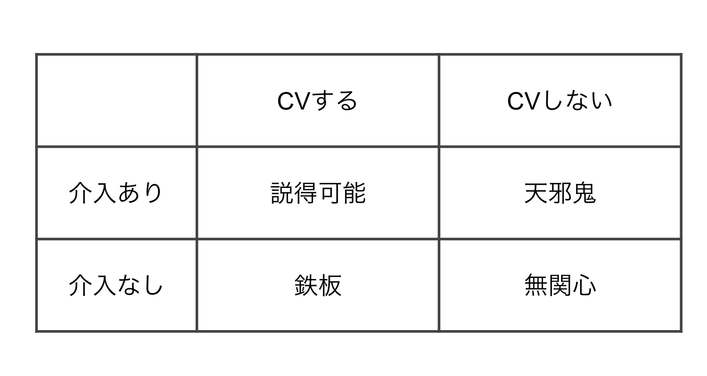

# AB テストを通じた Uplift Modeling の手順(1/7)

- AB テストを行い、以下のデータを取得する
  - X: 特徴量, Z: 介入有無 (0 or 1), Y: CV 有無 (0 or 1)

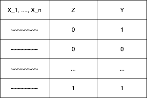

# AB テストを通じた Uplift Modeling の手順(2/7)

- Z==0, Z==1 でデータを分ける
- つまり介入有無でデータを分割する

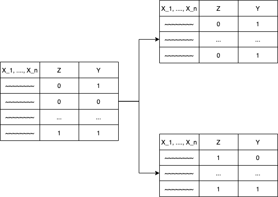

# AB テストを通じた Uplift Modeling の手順(3/7)

- Z==0, Z==1 ごとのモデルを作成

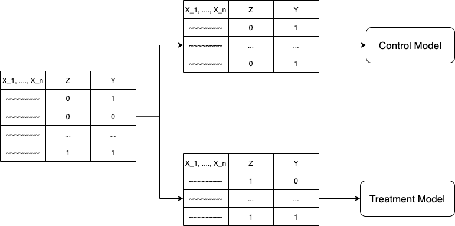

# AB テストを通じた Uplift Modeling の手順(4/7)

- 同様の検証データに対して作成したモデで予測

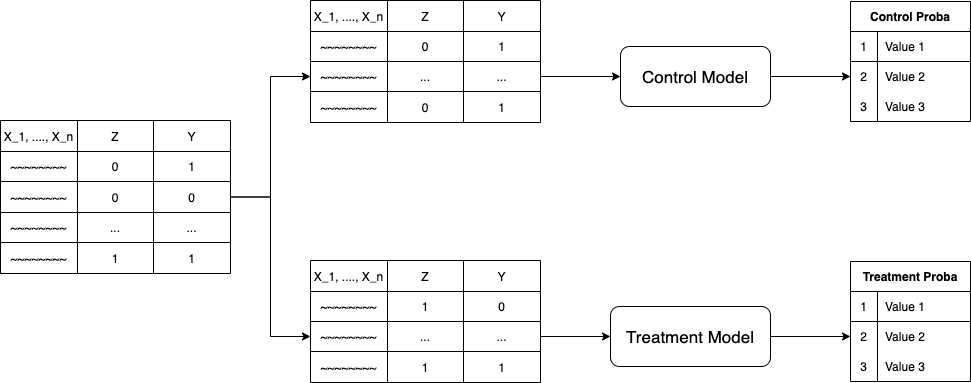

# AB テストを通じた Uplift Modeling の手順(5/7)

- 予測値から Uplift Score と Lift を取得
  - $Uplift\_Score = treat\_proba / control\_proba$
  - $Lift = treat\_proba - control\_proba$

# AB テストを通じた Uplift Modeling の手順(6/7)

- AUUC でモデルの評価を行う
- 青い線が介入した場合
- 左から UpliftScore が高い順に介入効果を積み上げている
- 曲線が下ぶれてくるあたりから天邪鬼が含まれてくる

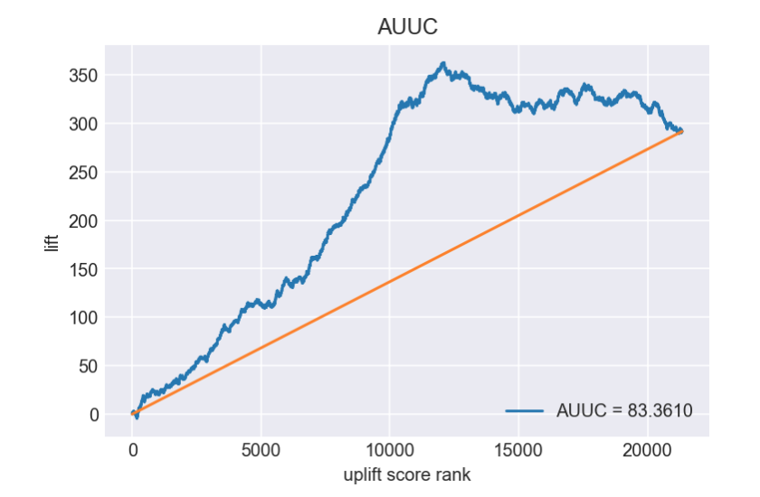

# AB テストを通じた Uplift Modeling の手順(7/7)

- UpliftScore でソートした Lift の累積和が最大値になるポイントを介入閾値に決定
- AUUC の横軸をデータ数から UpliftScore に変える
- UpliftScore = 1.1 あたりが最も介入効果が高いことがわかる

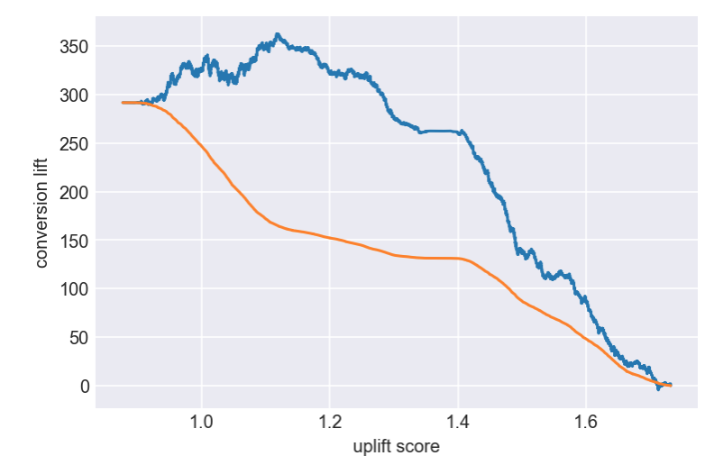

# Uplift Modeling の弱点

- **AB テストを行ったデータが必要**ということ
- （システム構成が複雑だとか？ユースケースあるの？とかは置いてといて）

# Uplift Modeling が仮定していること

- AB テストのより得られた反実仮想のデータを学習する
  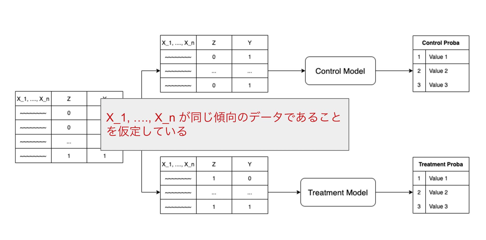

# バイアスを IPW で補正

- 介入有無により特徴量に偏りが生じる場合、反実仮想のデータが手に入らない
- そこで、IPW を使えばバイアスを補填できるのではないか:exclamation:と考えた

# IPW (Inverse Probability Weighting) とは

- 介入有無を学習したモデルの予測値が傾向スコア
- 傾向スコアを逆確率変換したものを重みとする
- これを IPW と呼ぶ
- IPW は介入が必然である個体を軽く、介入が偶然である個体を重く扱う
- 上記のような処理をすることでデータの偏りを調整する

# 傾向スコアの求め方

- 特徴量から介入有無を予測するモデルを作成
- そのモデルの予測値を傾向スコアとする

イメージ図
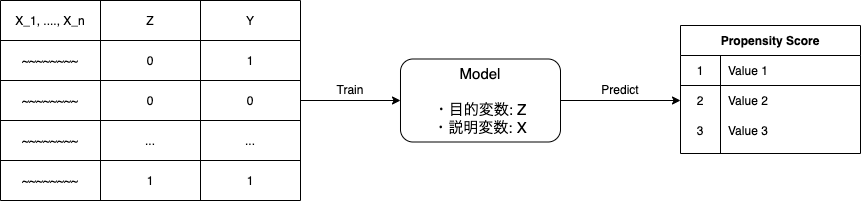

# IPW のイメージ図

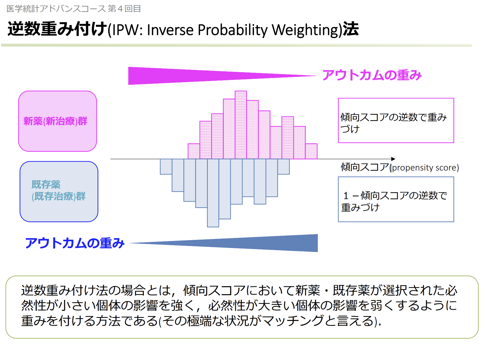

引用: [医学統計セミナー アドバンスコース 統計的因果推論と傾向スコア](https://waidai-csc.jp/updata/2018/08/seminar-igaku-20170222.pdf)

# IPW で Uplift Modeling の弱点を補填

立ち戻ると、

- バイアスのあるデータで Uplift Modeling がしたい
- しかし、Uplift Modelig は RCT のような反実仮想を想定したデータが必要
- バイアスがあっても IPW による補正で反実仮想を想定したデータを用意できるのではないか

# 重み付けモデルのイメージ図

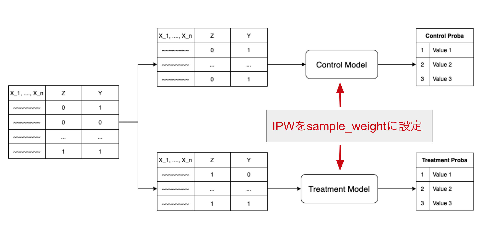

移行の手順は通常の Uplift Modeling と同じ

# バイアスを補填した Uplift Modeling の結果

それっぽい AUUC が出てくることが確認できた。
曲線のガタツキはデータ量によるものなのでデータが少ないときは注意が必要

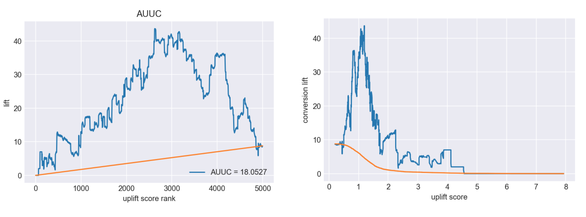

詳しい実装は[こちら](https://github.com/konumaru/pycalf/blob/master/examples/UpliftModelingWithIPW.ipynb)

# IPW の弱点

分類精度が高すぎる場合、以下のようなことが起こる

- 極端な重み付け
- 同質のデータが存在しない

詳しくは 岩波 DS vol.03 で

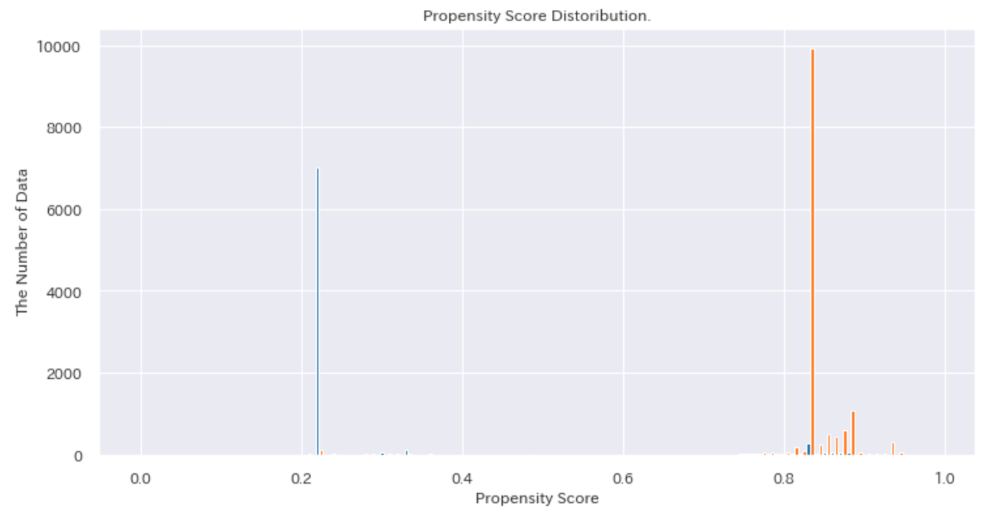

# 積み残し

- モデルの検証が不十分
- 意図した振る舞いなのかを検証するのが困難で、
  - AB テストの場合とバイアスがある場合のモデルの比較をしたいが単純には比較できない

検証の方法についてを真面目に考える必要がある

# まとめ

- Uplift Moddeling で介入効果を最大化できるよ
  - 介入することで CV する「説得可能」なセグメントを見つけることができる
- バイアスのあるデータでも Uplift Modeling ができたよ
  - IPW を sample_weight に設定することで反実仮想を仮定することができる
- ただし、傾向スコアをあまり信じすぎるのは危ないよ
  - 傾向スコアが極端な値を取っていないか、ある程度重なりがあるか確認する必要がある

# おまけ

- 実装は[pycalf](https://github.com/konumaru/pycalf)の example にあります
- 傾向スコアを利用しない手法として Uber が開発していた [causalML](https://github.com/uber/causalml) がある
  - meta-learner や causal-tree といった手法が使われている（らしい）
  - causalML の調査資料については[これ](https://speakerdeck.com/asei/overview-of-causalml)

# おわり
